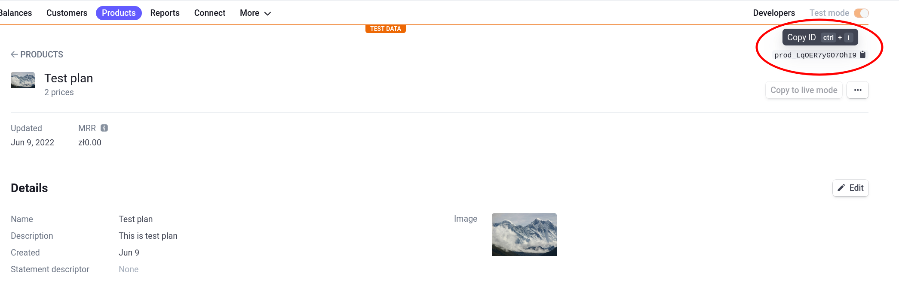
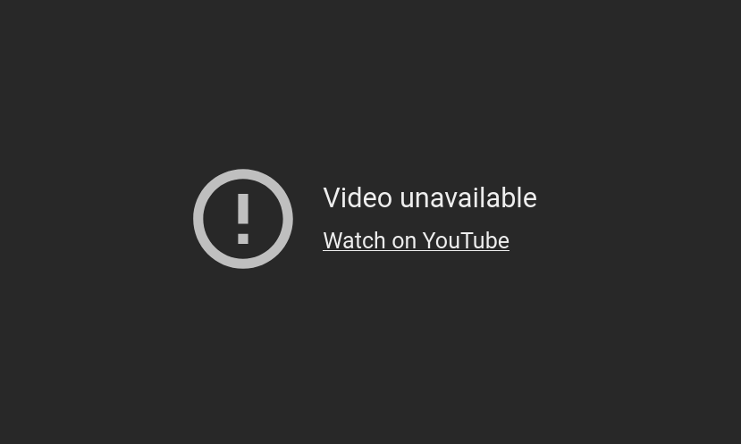

# VodFul

VodFul jest serwisem umożliwiającym zakup subskrypcji w celu oglądania materiałów wideo.

## Ustawienie środowiska

### Baza danych

Aplikacja współpracuje ze wszystkimi relacyjnymi bazami danych. Konfiguracja jest taka sama jak [w dokumentacji Laravel](https://laravel.com/docs/9.x/database#configuration).

Dostęp do bazy danych jest wymagany do poprawnego działania aplikacji

### Stripe

W celu otrzymania zdarzeń z platformy Stripe, aplikacja, jeśli działa na komputerze lokalnym, musi być połączona z chmurą przez Stripe CLI. Stripe oferuje [poradnik instalacji CLI](https://stripe.com/docs/stripe-cli). Należy zainstalować CLI zgodnie z krokami tam przedstawionymi. Po instalacji, można zalogować się do stripe za pomocą komendy

```bash
stripe login
```

i uruchomić przekazywanie zdarzeń komendą

```bash
stripe listen --forward-to localhost:8000/stripe/webhook
```

Uwaga! **Ta komenda musi działać przez cały czas testowania aplikacji**

#### Panel zarządzania Stripe

Panel zarządzania jest dostępny pod adresem <https://dashboard.stripe.com/>

> W celu testowania można się zalogować używając danych dostępowych z pliku [credentials.md](./credentials.md)

### MailHog

Aby odebrać testowe e-maile wysyłane z aplikacji można użyć aplikacji [MailHog](https://github.com/mailhog/MailHog). Po instalacji (zgodnie z instrukcjami w repozytorium), należy uruchomić program wywołując jego główny plik, n.p.

```bash
~/go/bin/MailHog
```

Do interfejsu można uzyskać dostęp pod adresem
[http://0.0.0.0:8025/](http://0.0.0.0:8025/)

Uwaga! **Ta komenda musi działać przez cały czas testowania aplikacji, aby możliwe było odbieranie wysyłanych przez aplikację e-maili**

### PHP / Laravel

Projekt używa [PHP](https://www.php.net/) w wersji 8.1.6
Projekt używa [Laravel](https://laravel.com/) w wersji 9.9.0
Projekt używa [composer](https://getcomposer.org/) w wersji 2.2.7
Projekt używa [Node.js](https://nodejs.org/en/) w wersji 17.9.0 z npm w wersji 8.5.5

Po zainstalowaniu tych wymaganych narzędzi, należy zainstalować wymagane pakiety. Aby to zrobić należy wykonać:

```bash
composer install
npm install
```

### Konfiguracja

Załączony z projektem plik `.env` zawiera konfigurację środowiska
Najważniejsze parametry, które mogą ulec zmianie to:

#### APP_KEY

Klucz służący do szyfrowania, można go regenerować komendą
`php artisan key:generate`

#### DB\_\*

Dane do połączenia z bazą danych. Szczególnie istotne jest, aby ustawić poprawne dane, gdyż bez tego, aplikacja nie będzie działała poprawnie.

#### MAIL_HOST

Domyślnie `MAIL_HOST=mailhog`, należy zmienić na `MAIL_HOST=localhost`, jeśli mailhog jest instalowany w sposób opisany powyżej.

#### MAIL_FROM_ADDRESS

Dla testowania przyjąłem `MAIL_FROM_ADDRESS="admin@example.com"`

#### STRIPE_KEY i STRIPE_SECRET

Para kluczy służąca do połączenia ze Stripe. wartości do testów można znaleźć w pliku [credentials.md](./credentials.md)

## Migracje i seed bazy danych

Aby zmigrować bazę danych należy uruchomić komendę:

```bash
php artisan migrate
```

Aby wypełnić bazę danych przykładowymi danymi należy wykonać komendę:

```bash
php artisan db:seed
```

## Uruchomienie

Po zainstalowaniu wszystkich pakietów można uruchomić aplikację

Przed uruchomieniem:

- sprawdź poprawność konfiguracji w pliku `.env`
- sprawdź, czy uruchomiony jest proces [Stripe CLI](#Stripe)
- sprawdź, czy uruchomiony jest proces [MailHog](#MailHog)
- sprawdź, czy baza danych jest dostępna i [przygotowana](#migracje-i-seed-bazy-danych)

Aby uruchomić aplikację w trybie deweloperskim należy wykonać

```bash
php artisan serve
```

Serwer wypisze, pod jakim adresem jest dostępna aplikacja. Domyślnie jest to [http://localhost:8000](http://localhost:8000).

## Główne funkcje

### Rejestracja użytkownika

Po naciśnięciu przycisku REGISTER w pasku nawigacyjnym, otworzy się okno rejestracji. Po wypełnieniu formularza i zatwierdzeniu go przyciskiem REGISTER, zostanie wysłany email weryfikacyjny pod podany adres email. Wiadomość ta może być odebrana w programie MailHog. Bez weryfikacji adresu email nie można aktywować planu, a co za tym idzie, oglądać filmów.

### Weryfikacja adresu email

Po rejestracji i odebraniu wiadomości w linkiem potwierdzającym email, należy w niego kliknąć, co potwierdzi adres email i jednocześnie zaloguje użytkownika.

#### Wyślij ponownie

Gdyby wiadomość nie dotarła, należy przejść do zakładki profilu. Jeśli użytkownik nie jest zweryfikowany, to zostanie wyświetlona prośba o zweryfikowanie adresu email z linkiem do ponownego wysłania wiadomości.

### Logowanie i wylogowanie

Logowanie następuje po kliknięciu przycisku LOGIN w pasku nawigacyjnym i podaniu poprawnych danych logowania.

Wylogowanie następuje po naciśnięciu przycisku LOGOUT.

#### Zapomniane hasło

W przypadku zapomnienia hasła, można kliknąć w link `Forgot password?` poniżej formularza logowania. Potem, na podany w kolejnym kroku adres email, zostanie wysłany link umożliwiający zresetowanie hasła.

### Wybór planu

W aplikacji po pierwszym seedzie są dostępne 2 domyślne plany:

- Basic Plan
- Pro Plan

Użytkownik może wybrać jeden z nich, po tym wyborze zostanie przekierowany na platformę stripe w celu sfinalizowania płatności.

Wybór planu i pomyślny przebieg płatności są niezbędne w celu oglądania filmów.

#### Subskrybenci

Po sfinalizowaniu zakupu, użytkownik ma aktywny plan, staje się _subskrybentem_

### Oglądanie filmów

Po zalogowaniu się, [subskrybenci](#subskrybenci) mogą przejść na stronę dowolnego filmu i go obejrzeć. Aby to zrobić wystarczy że klikną w dowolny obrazek filmu lub w strzałkę obok filmu w galerii na stronie głównej, lub w przycisk `Radom movie!` na stronie głównej.

Kiedy film zaczyna być oglądany, automatycznie zapisuje się w [Historii Oglądania](#)

#### Gatunki

Żeby przeglądać filmy według gatunków należy wybrać z paska nawigacji pozycję `Genres` i następnie wybrać gatunek, o który nam chodzi.

Filmy z danego gatunku ładowane są na zasadzie Infinite Scroll w ilości 16 na jedno zapytanie.

Informacja: Ilustracje do gatunków są dynamicznie dobierane przez stronę <https://loremflickr.com/> i ich zawartość zmienia się z każdym załadowaniem strony.

### Ulubione filmy

Każdy z filmów może zostać dodany jako ulubiony do listy danego użytkownika. Jeśli chcemy to zrobić, należy kliknąć symbol `+` (w przypadku miniatur filmów) lub przycisk `Add to my favourites` (na stronie oglądania filmu)

#### Przeglądanie ulubionych

Ulubione filmy można znaleźć w swoim [profilu](#twoje-ulubione-filmy).

### Profil

To miejsce do zarządzania profilem. W górnej części wyświetla się nazwa obecnie zalogowanego użytkownika i jego email.

#### Zarządzanie subskrypcją

W tym miejscu wyświetla się monit o wybór planu subskrypcji, jeśli użytkownik nie jest subskrybentem lub informacje o obecnym planie, jeśli jest subskrybentem.

#### Zmiana hasła

Hasło można zmienić klikając w przycisk `Change password` i wpisując stare oraz nowe hasło.

#### Usunięcie konta

Jeśli chcesz usunąć konto, kliknij w `Delete account` i potwierdź wyświetlony monit.

Uwaga! Tej akcji nie można cofnąć.

#### Twoje ulubione filmy

Tu można znaleźć filmy dodane do ulubionych

#### Ostatnio oglądane filmy

Tu można znaleźć filmy, które ostatnio oglądaliśmy.

### Panel administracyjny

Jeśli użytkownik został oznaczony jako administrator, to może on zarządzać najważniejszymi elementami strony

Aby przejść do panelu administracyjnego należy zalogować się na profil administratora i kliknąć w link w pasku nawigacyjnym `admin`.

> Dane do logowania do panelu administratora można znaleźć w pliku [credentials.md](./credentials.md)

#### Zarządzanie filmami

Po wejściu w panel zarządzania filmami, administrator widzi tabelę wszystkich filmów dostępnych na platformie

##### Filtrowanie filmów

Użytkownik ma możliwość filtrowania listy po gatunku filmu, zmiany liczby rekordów wyświetlanych na stronę i wyszukiwania uwzględniającego tytuł, gatunek, rok premiery i opis filmu.
Przycisk `clear filters` czyści wszystkie zmiany w tych polach.

##### Dodawanie filmu

Po naciśnięciu przycisku `Create new movie` otwiera się strona dodawania nowego filmu.
Tam należy wypełnić wszystkie pola (opis może pozostać pusty) i przesłać formularz. W przypadku, jeśli formularz zawiera błędy, wyświetli się stosowny komunikat.

##### Usuwanie filmu

Aby usunąć film należy nacisnąć czerwony przycisk z ikoną kosza znajdujący się w tabeli wszystkich filmów.

Po usunięciu filmu wyświetli się komunikat dzięki któremu można go jeszcze przez kilka sekund przywrócić.

##### Edycja filmu

Po naciśnięciu przycisku z ikoną ołówka w tabeli, otwiera się strona edycji filmu.
Tam należy zmienić pola, które chcemy edytować i przesłać formularz. W przypadku, jeśli formularz zawiera błędy, wyświetli się stosowny komunikat.

#### Zarządzanie użytkownikami

Po wejściu w panel zarządzania użytkownikami, administrator widzi tabelę wszystkich użytkowników zarejestrowanych na platformie

##### Filtrowanie użytkowników

Użytkownik ma możliwość filtrowania listy po statusie użytkownika (czy jest administratorem), zmiany liczby rekordów wyświetlanych na stronę i wyszukiwania uwzględniającego imię i email użytkownika.
Przycisk `clear filters` czyści wszystkie zmiany w tych polach.

##### Usuwanie użytkownika

Aby usunąć użytkownika należy nacisnąć czerwony przycisk z ikoną kosza znajdujący się w tabeli wszystkich użytkowników.

Po usunięciu użytkownika wyświetli się komunikat dzięki któremu można go jeszcze przez kilka sekund przywrócić.

##### Przypisanie roli administratora

Administratorzy mogą nadawać i odbierać rolę administratora innym użytkownikom. Aby to zrobić należy użyć przycisku w kolumnie `is admin`

#### Zarządzanie planami

Po wejściu w panel zarządzania użytkownikami, administrator widzi listę wszystkich planów na platformie.

##### Zmiana kolejności planów

Aby zmienić kolejność wyświetlanych planów, wystarczy użyć metody przeciągnij i upuść. Zmiany są zapisywane automatycznie.

##### Dodawanie planu

Aby dodać nowy plan, najpierw należy go stworzyć jako produkt z przynajmniej jedną ceną z atrybutem `recurring` w [panelu Stripe](#panel-zarządzania-stripe).

Następnie, należy skopiować ID produktu z górnego prawego rogu panelu produktu w Stripe, jak pokazano na zrzucie ekranu poniżej.



Kolejnym krokiem jest naciśnięcie przycisku `Add plan` i podanie ID produktu stripe i, opcjonalnie, nazwy planu. Jeśli nazwa nie zostanie podana, będzie używana nazwa z produktu stripe.

##### Usuwanie i ukrywanie planu

Plan można ukryć lub usunąć.
W tej chwili obie te czynności powodują jedynie, że plan znika z listy dostępnych planów w wyborze planu użytkownika.
Jednak, z użyciem logiki bazy danych, można usuwać plany oznaczone do usunięcia, jeśli wszyscy użytkownicy, którzy mieli ten plan przypisany przeszli na inne plany.

## Troubleshooting

### Video unavailable



- sprawdź, czy do połączenia z aplikacją używasz adresu [localhost:8000](http://localhost:8000), a nie adresu IP (127.0.0.1). W przypadku korzystania z adresu IP filmy youtube są blokowane

## Laravel License

[The Laravel framework](https://laravel.com/) is open-sourced software licensed under the [MIT license](https://opensource.org/licenses/MIT).

## UiKit License

[UIkit](https://github.com/uikit/uikit) is open-sourced software licensed under the [MIT license](https://opensource.org/licenses/MIT).
